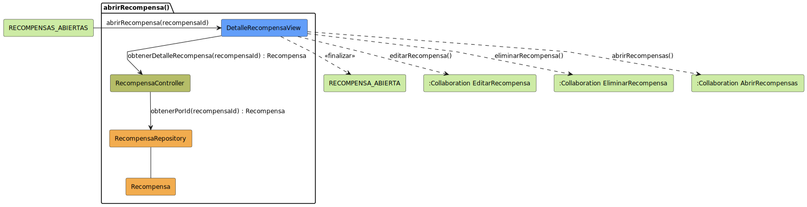

# Análisis: abrirRecompensa

Este archivo documenta el análisis del caso de uso **abrirRecompensa**.

## Diagrama de Análisis (BCE)

---

## Documentación Técnica

El diagrama ha sido movido a la carpeta de modelos UML para mantener la limpieza de la documentación.

- **Código fuente del diagrama:** [abrirRecompensa-analisis.puml](../../../../modelosUML/analisis/casosDeUsos/abrirRecompensa/abrirRecompensa-analisis.puml)
