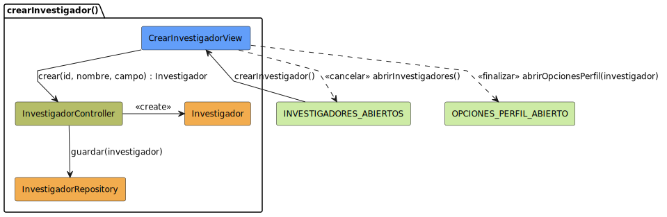

# Análisis: crearInvestigador

Este archivo documenta el análisis del caso de uso **crearInvestigador**.

## Diagrama de Análisis (BCE)

---

## Documentación Técnica

El diagrama ha sido movido a la carpeta de modelos UML para mantener la limpieza de la documentación.

- **Código fuente del diagrama:** [crearInvestigador-analisis.puml](../../../../modelosUML/analisis/casosDeUsos/crearInvestigador/crearInvestigador-analisis.puml)
