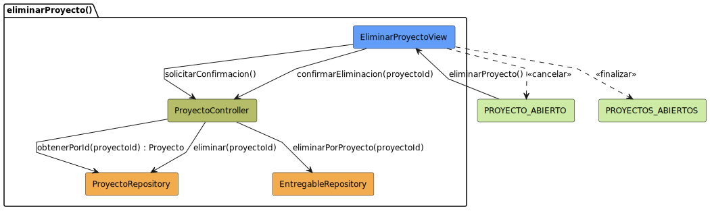

# Análisis: eliminarProyecto

Este archivo documenta el análisis del caso de uso **eliminarProyecto**.

## Diagrama de Análisis (BCE)

---

## Documentación Técnica

El diagrama ha sido movido a la carpeta de modelos UML para mantener la limpieza de la documentación.

- **Código fuente del diagrama:** [eliminarProyecto-analisis.puml](../../../../modelosUML/analisis/casosDeUsos/eliminarProyecto/eliminarProyecto-analisis.puml)
