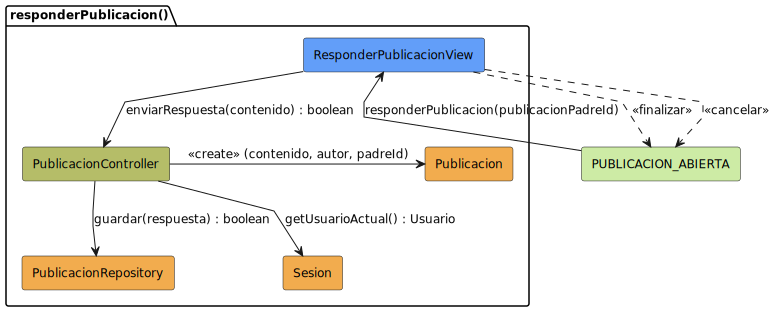

# Análisis: responderPublicacion

Este archivo documenta el análisis del caso de uso **responderPublicacion**.

## Diagrama de Análisis (BCE)

---

## Documentación Técnica

El diagrama ha sido movido a la carpeta de modelos UML para mantener la limpieza de la documentación.

- **Código fuente del diagrama:** [responderPublicacion-analisis.puml](../../../../modelosUML/analisis/casosDeUsos/responderPublicacion/responderPublicacion-analisis.puml)
