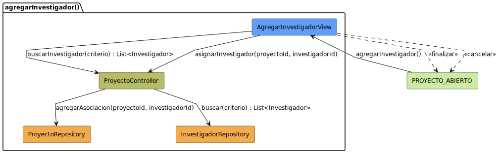

# Diseño: agregarInvestigador
Este archivo documenta el diseño del caso de uso **agregarInvestigador**.

## Diagrama de Secuencia

---

## Documentación Técnica
- **Código fuente del diagrama:** [agregarInvestigador.puml](../../../../modelosUML/diseño/casosDeUsos/agregarInvestigador/agregarInvestigador.puml)
