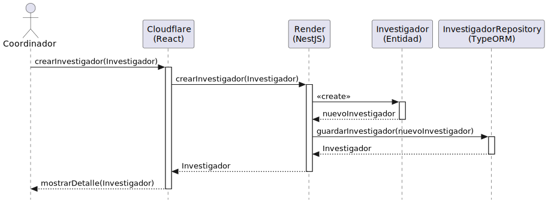

# Diseño: crearInvestigador
Este archivo documenta el diseño del caso de uso **crearInvestigador**.

## Diagrama de Secuencia

---

## Documentación Técnica
- **Código fuente del diagrama:** [crearInvestigador.puml](../../../../modelosUML/diseño/casosDeUsos/crearInvestigador/crearInvestigador.puml)
