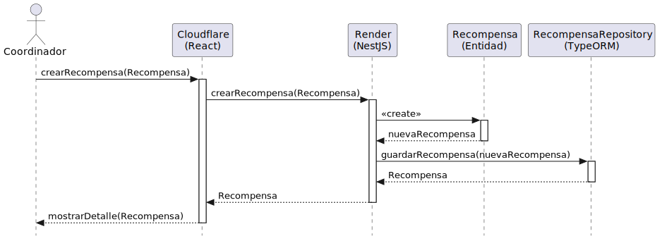

# Diseño: crearRecompensa
Este archivo documenta el diseño del caso de uso **crearRecompensa**.

## Diagrama de Secuencia

---

## Documentación Técnica
- **Código fuente del diagrama:** [crearRecompensa.puml](../../../../modelosUML/diseño/casosDeUsos/crearRecompensa/crearRecompensa.puml)
