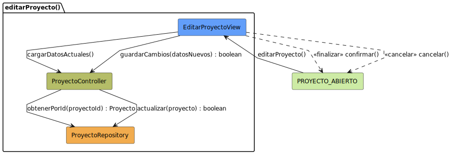

# Diseño: editarProyecto
Este archivo documenta el diseño del caso de uso **editarProyecto**.

## Diagrama de Secuencia

---

## Documentación Técnica
- **Código fuente del diagrama:** [editarProyecto.puml](../../../../modelosUML/diseño/casosDeUsos/editarProyecto/editarProyecto.puml)
