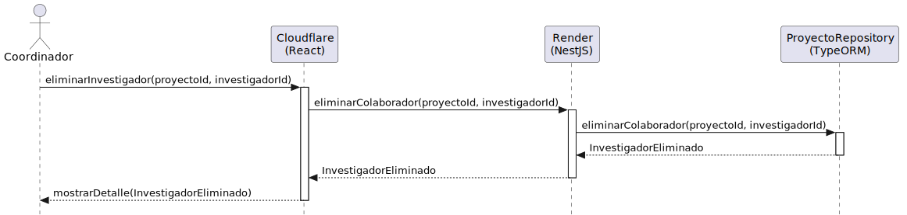

# Diseño: eliminarInvestigador
Este archivo documenta el diseño del caso de uso **eliminarInvestigador**.

## Diagrama de Secuencia

---

## Documentación Técnica
- **Código fuente del diagrama:** [eliminarInvestigador.puml](../../../../modelosUML/diseño/casosDeUsos/eliminarInvestigador/eliminarInvestigador.puml)
